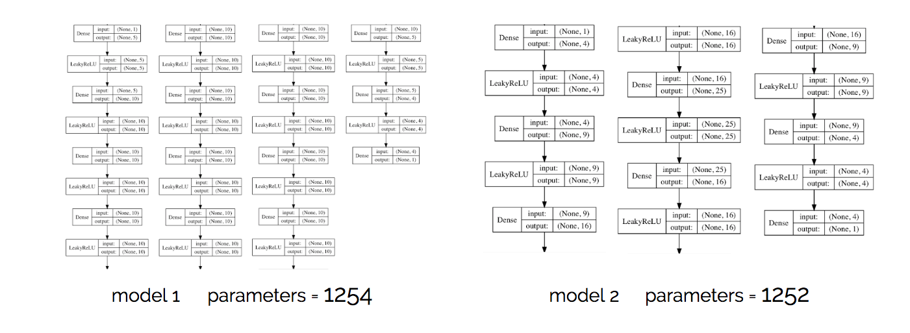
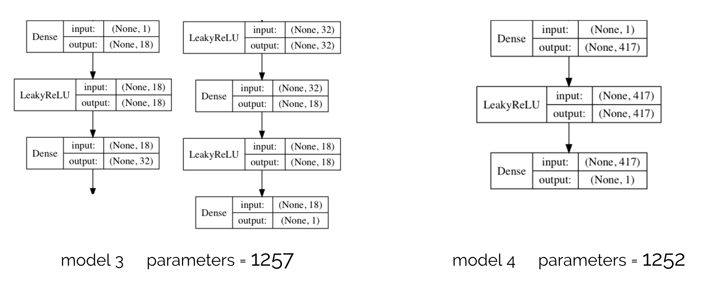
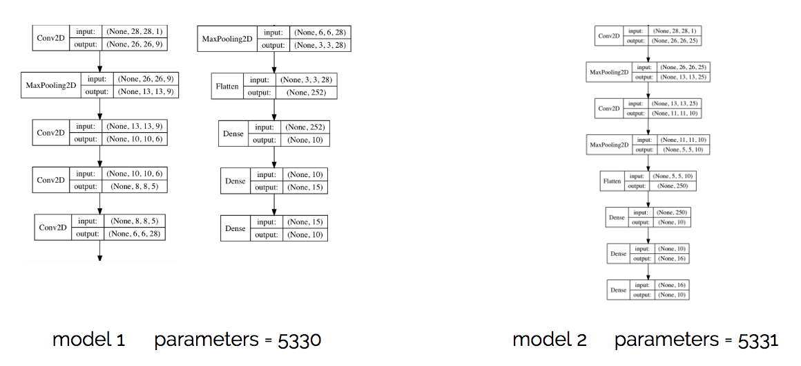
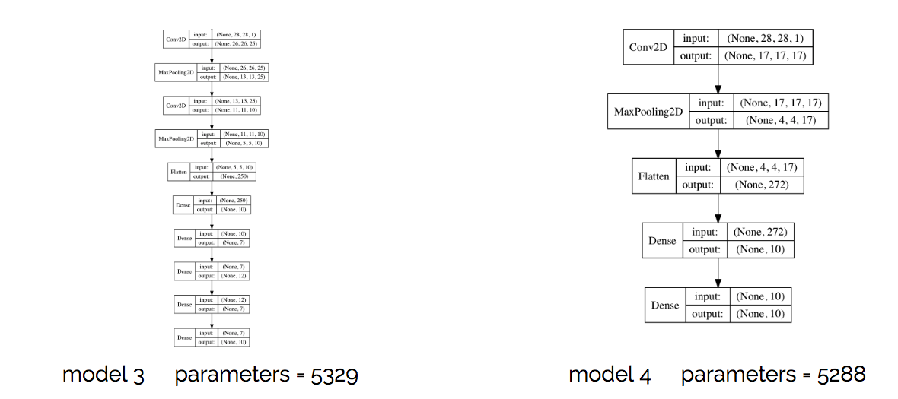
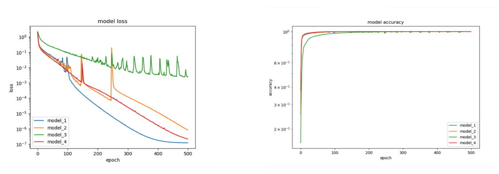

# MLDS_hw1
* [Getting Started](#getting-started)
    * [Prerequisites](#prerequisites)
    * [Installing](#installing)
* [Function Simulation](#function-simulation)
    * [Models](#dnn-models)
    * [Simulated Function](#simulated-functions)
    * [Conclusion](#dnn-conclution)
* [Train on Actual Task](#train-on-actual-task)
    * [CNN Models](#cnn-models)
    * [Loss and Accuracy](#loss-and-accuracy)
    * [Conclusion](#cnn-conclution)
## Getting Started
### Prerequisites
    $ pip install tensorflow
    $ pip install keras
### Installing
#### [Function Simulation](##function-simulation)
    $ python sim_func.py
#### [Train on Actual Task](##train-on-actual-task)
    $ python cnn.py
## Function Simulation

### Models

### Simulated Functions
- y = sin(3πx) + sin(4πx)

    
- y = esp(sin(40x)) * log(x+1)

    

### Conclution 
    Deeper is better (in our case)
    Functions cannot be too simple or complicated
    LeakyReLU seems to work better than ReLU
        Dying ReLU problem
        LeakyReLU, ELU can solve the problem

## Train on Actual Task

### Models

### Loss and Accuracy

### Conclution 
    Thicker convolutional layer may not perform better
    For such easy cases, more hidden layers seem not to be beneficial
    Model 4 performs the best

