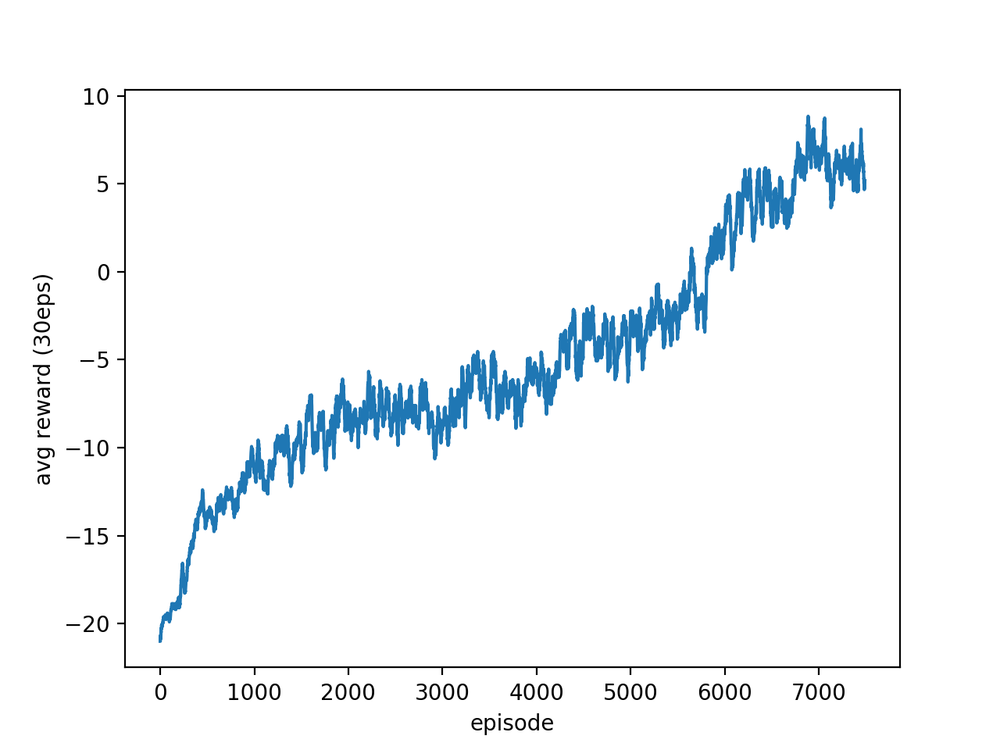

# MLDS HW4
## Installation
Type the following command to install OpenAI Gym Atari environment.

`$ pip3 install opencv-python gym gym[atari]`

Please refer to [OpenAI's page](https://github.com/openai/gym) if you have any problem while installing.

## How to run :
training policy gradient:
* `$ python3 main.py --train_pg`

testing policy gradient:
* `$ python3 test.py --test_pg`

training DQN:
* `$ python3 main.py --train_dqn`

testing DQN:
* `$ python3 test.py --test_dqn`

## Results
### Pong (PPO)
#### Model
##### gray scale -> difference between frames
##### Conv(filter = 32, kernel = [8,8], strides = [4,4])
##### Conv(filter = 64, kernal = [4,4]m strides = [2,2])
##### Flatten
##### Dense(128)
##### Dense(2)
#### Tips
##### Variance Reduction
#### Test result: mean = 9.8

