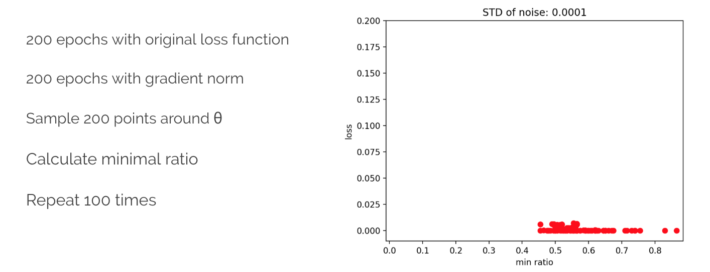

# MLDS_hw1
* [Getting Started](#getting-started)
    * [Prerequisites](#prerequisites)
    * [Installing](#installing)
* [HW1-1](#HW1-1)
    * [Function Simulation](#function-simulation)
        * [Models](#dnn-models)
        * [Simulated Function](#simulated-functions)
        * [Conclusion](#dnn-conclusion)
    * [Train on Actual Task](#train-on-actual-task)
        * [CNN Models](#cnn-models)
        * [Loss and Accuracy](#loss-and-accuracy)
        * [Conclusion](#cnn-conclusion)
* [HW1-2](#HW1-2)
    * [Visualize the optimization process](#visualize-the-optimization-process)
    * [Observe gradient norm during training](#observe-gradient-norm-during-training)
        * [Conclusion](#observe-conclusion)
    * [What happens when gradient is almost zero](#what-happens-when-gradient-is-almost-zero)
        * [Conclusion](#zero-conclusion)
    * [Visualize the error surface](#visualize-the-error-surface)
* [HW1-3](#HW1-3)
	* [Can network fit random labels?](#can-network-fit-random-labels)
	* [Number of parameters v.s. Generalization](#number-of-parameters-vs-generalization)
	* [Flatness v.s. Generalization](#flatness-vs-generalization)
	* [Flatness v.s. Generalization: Bonus](#flatness-vs-generalization-bonus)

## Getting Started
### Prerequisites
    $ pip install tensorflow
    $ pip install keras
#### Pytorch
    go to https://pytorch.org/
    choose your operting system and install pytorch
### Installing
#### [Function Simulation](##function-simulation)
##### 1 for the first function, 2 for the second
    $ python sim_func.py 1
    $ python sim_func.py 2
#### [Train on Actual Task](##train-on-actual-task)
    $ python cnn.py
#### [Visualize the optimization process](#visualize-the-optimization-process)
    $ python pca.py
#### [Observe gradient norm during training](#observe-gradient-norm-during-training)
	$ python min_ratio_grad.py
#### [What happens when gradient is almost zero](#what-happens-when-gradient-is-almost-zero)
    $ python min_ratio.py
#### [Visualize the error surface](#visualize-the-error-surface)
	$ python err_surface.py
#### [Can network fit random labels?](#can-network-fit-random-labels)
	$ python shuffled_label_keras.py
#### [Number of parameters v.s. Generalization](#number-of-parameters-vs-generalization)
	$ python number_of_params.py
#### [Flatness v.s. Generalization](#flatness-vs-generalization)
#### Part 1
	$ python inter_model.py
#### Part 2
	$ python sensitivity.py
#### [Flatness v.s. Generalization: Bonus](#flatness-vs-generalization-bonus)
	$ python bonus.py

## HW1-1    
### Function Simulation

#### Models

#### Simulated Functions
- y = sin(3πx) + sin(4πx)

    
- y = esp(sin(40x)) * log(x+1)

    

#### Conclusion 
    Deeper is better (in our case)
    Functions cannot be too simple or complicated
    LeakyReLU seems to work better than ReLU

### Train on Actual Task

#### Models

#### Loss and Accuracy

#### Conclusion 
    Thicker convolutional layer may not perform better
    For such easy cases, more hidden layers seem not to be beneficial
    Model 4 performs the best

## HW1-2
### Visualize the optimization process

### Observe gradient norm during training

#### Conclusion
    Norm of gradient lowers together obviously.
    However when it comes to complicated functions, such as exp(.sin(40*x))*log(x+1), it is hard to master gradient norm's behavior. (but it still tends to decrease)
### What happens when gradient is almost zero

#### Conclusion
    When we  start training on gradient norm, there will be a jump on both loss and norm.
    When train with complicate function, result can get worse when minimizing gradient norm.
### Visualize the error surface

## HW1-3
### Can network fit random labels?

#### The more the parameters, the higher the accuracy.

## Flatness v.s. Generalization
#### Part 1

#### Part 2

#### Comment on result:
1. Smaller batch size leads to slightly better result than larger batch size (lower loss)
2. Smaller batch size leads to flatter minima, which indicates lower sharpness
3. Model trained with small batch size is less sensitive to change of input
### Flatness v.s. Generalization: Bonus

#### Comment on result
1. It seems like our result is slightly different from what we expected.
2. We calculate the sharpness with the norm of  tf.hessians, and the hessian is calculated with the average loss in a batch. Perhaps the small batch size leads to less accurate result.

